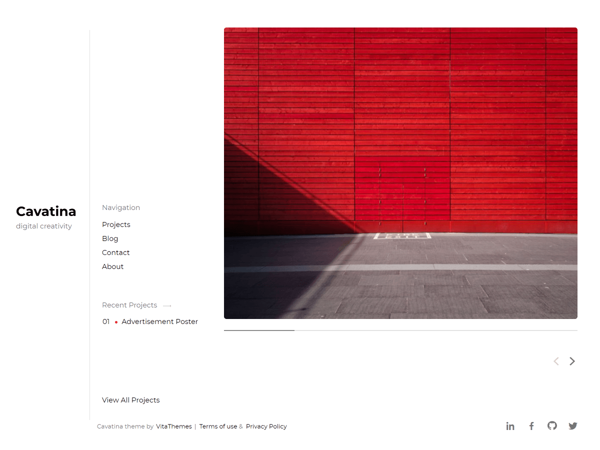

# Cavatina - [Demo](https://demo.vitathemes.com/cavatina/)

Cavatina is a minimal & mobile-first theme. The best choice for people who want to introduce their projects.




## Features

- Sass for stylesheets
- Compatible with [Contact Form 7](https://wordpress.org/plugins/contact-form-7/)
- Theme options built directly into WordPress native live theme customizer
- Responsive design
- Cross-browser compatibility
- Custom Google WebFonts
- Child themes support
- Developer friendly extendable code
- Translation ready (with .POT files included)
- Right-to-left (RTL) languages support
- SEO optimized
- GNU GPL version 2.0 licensed
- Support 5 levels sub-menus
- …and much more

See a working example at [demo.vitathemes.com/cavatina](https://demo.vitathemes.com/cavatina/).

## Theme installation

1. Simply install as a normal WordPress theme and activate.
2. In your admin panel, navigate to `Appearance > Customize`.
3. Put the finishing touches on your website by adding a logo, typography settings, custom colors and etc.

## Theme structure

```shell
themes/cavatina/                 # → Root of your theme
│── assets/                      # → Theme internal assets
├── inc/                         # → Theme functions
│   ├── kirki/                   # → Kirki Customization framework
│   ├── customizer.php           # → All codes related to WordPress Customizer (We use Kirki Framework)
│   ├── template-functions.php   # → Custom template tweaks
│   └── template-tags.php        # → Custom template tags
│   └── setup.php                # → Custom post type setup
│   └── hooks.php                # → Theme custom hooks
│── js/                          # → Theme js files
├── language/                    # → Theme Language files
├── page-template/               # → Theme Part files (Include) - Pages
├── template-parts/              # → Theme Part files (Include)
├── node_modules/                # → Node.js packages
├── package.json                 # → Node.js dependencies and scripts
```

## Theme setup

Edit `functions.php` to enable or disable theme features, setup navigation menus, post thumbnail sizes, and sidebars.

## Theme development

- Run `npm install` from the theme directory to install dependencies
- Run `gulp` from the root of theme directory and it's starting to watch any changes in scss files from the `sass` folder

## Contributing

Contributions are welcome from everyone. We have [contributing guidelines](CONTRIBUTING.md) to help you get started.

## Changelog

See the [Changelog](CHANGELOG.md)

## License

Cavatina is licensed under [GNU GPL](LICENSE).
